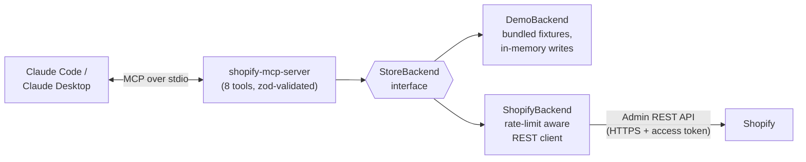

# Shopify MCP Server

Connect Claude to your Shopify store. This [Model Context Protocol](https://modelcontextprotocol.io) server gives Claude Code and Claude Desktop safe, structured access to products, orders, customers, inventory and sales analytics — so you can ask things like:

> *"Which orders from last week are still unfulfilled?"*
> *"Summarize June sales and tell me my top 5 products."*
> *"Set the M-size Summit Leggings stock to 40."*

It ships with a complete **demo store** (Aurora Athletics — 30 products, 60 orders, 25 customers), so you can try every tool in under a minute with zero credentials, then point it at a real store when you're ready.

## Tools

| Tool | Type | What it does |
|---|---|---|
| `search_products` | read | Keyword search across titles, handles, types, vendors, tags and SKUs |
| `get_product` | read | Full product detail by id or handle: variants, SKUs, prices, live inventory |
| `list_orders` | read | Recent orders with status filter (`any`/`open`/`closed`/`cancelled`) and date range |
| `get_order` | read | One order in full: line items, totals breakdown, payment/fulfillment status, tracking numbers |
| `get_customer` | read | Customer profile by email or id, with lifetime stats and recent order history |
| `update_inventory` | **write** | Set a variant's available quantity (absolute); reports previous value so changes are reversible |
| `sales_summary` | read | Revenue, refunds, order count, AOV, best day and top products for any date range |
| `top_customers` | read | Customers ranked by net spend for any date range, with order counts and last-order dates |

## Architecture



Both backends implement one `StoreBackend` interface, so every tool — including the `sales_summary` aggregation pipeline — behaves identically against fixtures and against a live store. The live client retries HTTP 429s (honoring `Retry-After`) and transient 5xx/network errors with exponential backoff, and follows Shopify's cursor pagination for analytics windows.

## Quickstart (demo mode, no credentials)

Requires Node.js 20+.

```bash
git clone https://github.com/sahididrishi/shopify-mcp-server.git && cd shopify-mcp-server
npm install
npm run build
```

Add it to **Claude Code**:

```bash
claude mcp add shopify -- node /absolute/path/to/shopify-mcp-server/dist/index.js
```

Or to **Claude Desktop** (`claude_desktop_config.json`):

```json
{
  "mcpServers": {
    "shopify": {
      "command": "node",
      "args": ["/absolute/path/to/shopify-mcp-server/dist/index.js"]
    }
  }
}
```

Then just ask Claude: *"Search the store for leggings"* or *"Give me a sales summary for the last 30 days."*

With no Shopify credentials configured, the server automatically serves the fictional **Aurora Athletics** activewear store. Every tool is fully functional: analytics are computed from 60 realistic orders whose dates are rebased at startup, so the demo store always looks like it traded over the last 90 days. Inventory writes are held in memory and reset on restart — nothing touches the network.

### Try it without Claude

```bash
npm run try-it
```

Spawns the built server as a real subprocess, connects an MCP client over stdio, and exercises `search_products`, `get_order`, `get_customer` and `sales_summary` with pretty-printed output. Exits non-zero on any failure, so it doubles as an integration test.

## Connecting a real Shopify store

1. In your Shopify admin, go to **Settings → Apps and sales channels → Develop apps** and click **Create an app** (enable custom app development if prompted).
2. Under **Configuration → Admin API integration**, grant scopes:
   - `read_products`, `read_orders`, `read_customers`, `read_inventory`
   - `write_inventory` — only if you want the `update_inventory` tool to work; omit it for a read-only server
3. Under **API credentials**, click **Install app**, then reveal and copy the **Admin API access token** (starts with `shpat_`). Shopify shows it once — store it safely.
4. Configure the server via environment variables (see `.env.example`):

```bash
claude mcp add shopify \
  --env SHOPIFY_STORE_DOMAIN=your-store.myshopify.com \
  --env SHOPIFY_ACCESS_TOKEN=shpat_xxxxxxxxxxxxxxxx \
  -- node /absolute/path/to/shopify-mcp-server/dist/index.js
```

| Variable | Required | Description |
|---|---|---|
| `SHOPIFY_STORE_DOMAIN` | for live mode | The `*.myshopify.com` domain (not your custom storefront domain) |
| `SHOPIFY_ACCESS_TOKEN` | for live mode | Custom app Admin API access token (`shpat_...`) |
| `SHOPIFY_API_VERSION` | no | Admin API version, defaults to `2026-04` |

If neither of the first two is set, the server runs in demo mode. If only one is set, it exits with a clear error rather than silently serving demo data.

## Security notes

- **Your token never leaves your machine.** The server runs locally, speaks to Claude over stdio (no listening ports), and sends the token only to `https://<your-store>.myshopify.com`.
- **Scope to what you need.** Grant read-only scopes and the server is physically incapable of modifying your store — `update_inventory` will return a clear 403 explanation instead.
- **One deliberate write path.** `update_inventory` is the only mutating tool, it is labelled `WRITE OPERATION` in its description so Claude treats it accordingly, and it echoes the previous quantity so any change can be reversed.
- Keep `.env` files out of version control (`.gitignore` here already does).

## Development

```bash
npm test                    # vitest: 44 unit + end-to-end tool tests, no network
npm run build               # tsc + fixture copy
npm run try-it              # integration smoke test against the built server
npm run generate-fixtures   # regenerate the demo store (seeded, deterministic)
```

The test suite drives the real MCP server through an in-memory client/server transport pair and pins the demo backend's reference date, so aggregation math in `sales_summary` is asserted against exact known-good figures.

### Project layout

```
src/
  index.ts           entry point: backend selection + stdio transport
  server.ts          MCP server: tool registration, schemas, error mapping
  backend.ts         StoreBackend interface shared by both backends
  backends/
    shopify.ts       live Admin REST API client (retry, pagination, mapping)
    demo.ts          fixture-backed store with date rebasing
  analytics.ts       pure sales aggregation (unit tested)
  format.ts          markdown rendering for tool output
  fixtures/          Aurora Athletics demo data (JSON)
scripts/
  try-it.ts          stdio integration demo
  generate-fixtures.ts  deterministic fixture generator
tests/               vitest suites
```

## License

MIT © 2026 Sahid Idrishi
